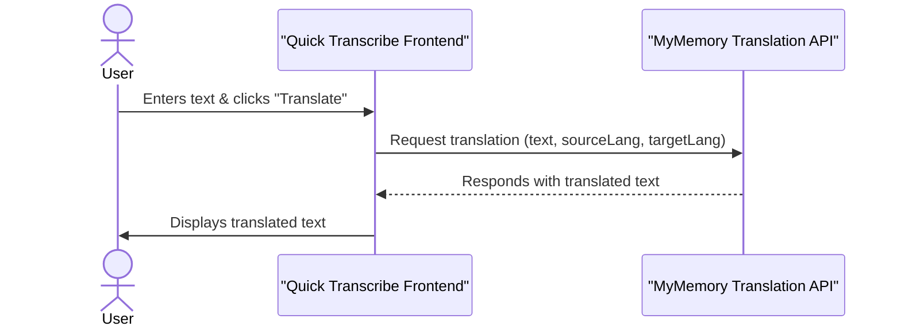
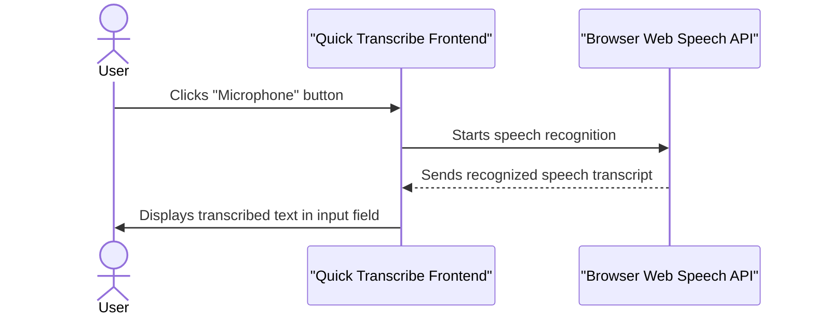
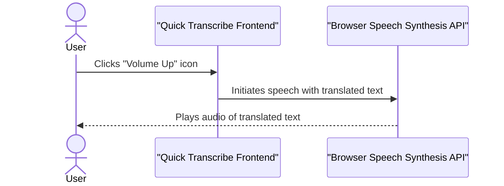
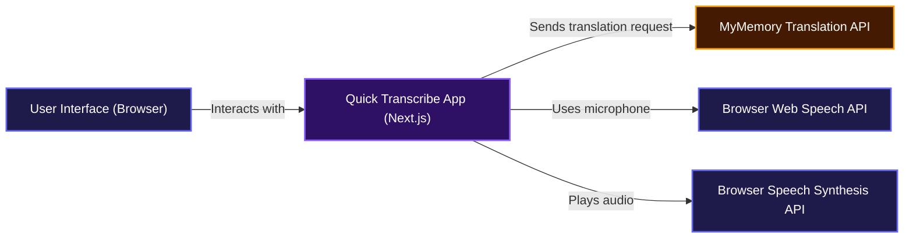

# Quick Transcribe

<p align="center">
  <a href="https://nextjs.org" target="_blank">
    
  </a>
</p>

## Overview

Quick Transcribe is a straightforward web application that helps you easily translate text between different languages and even transcribe spoken words. It takes your input, processes it, and gives you back exactly what you need, whether it's a translation or a transcription of your speech. It's designed to be simple to use, so you can focus on getting your message across without any fuss.

## Installation

Getting Quick Transcribe up and running on your local machine is super easy. Just follow these steps:

1.  **Clone the Repository**:
    First, grab a copy of the project files from GitHub:

    ```bash
    git clone https://github.com/samueltuoyo15/Quick-Transcribe
    cd Quick-Transcribe
    ```

2.  **Install Dependencies**:
    Once you're in the project directory, install all the necessary packages using npm:

    ```bash
    npm install
    ```

3.  **Run the Development Server**:
    Now you can start the development server. This will launch the application on your local machine, usually at `http://localhost:3000`:

    ```bash
    npm run dev
    ```

That's it! The application should now be running in your browser.

## Usage

Using Quick Transcribe is pretty intuitive. Here's how you can make the most of it:

1.  **Enter Text for Translation**:
    Type or paste the text you want to translate into the input field.

2.  **Select Source and Target Languages**:
    At the bottom of the screen, you'll see two buttons showing the current source and target languages (e.g., "English" and "French"). Click either of these buttons to open a language selection dialog. You can search for a language or scroll through the list to pick the one you need.

3.  **Translate Your Text**:
    After entering your text and selecting your languages, click the "Translate" button. The translated text will appear in the display area. While it's translating, you'll see the recycle icon next to the button spinning.

4.  **Switch Languages**:
    If you want to quickly swap the source and target languages, just click the exchange icon (`<-->`) between the language selection buttons at the bottom.

5.  **Listen to Translated Text**:
    Once you have a translation, you'll see a speaker icon (`<FaVolumeUp>`) appear below the translated text. Click this icon to hear the translated text spoken aloud.

6.  **Copy Translated Text**:
    Next to the speaker icon, you'll find a copy icon (`<FaCopy>`). Click this to instantly copy the translated text to your clipboard.

7.  **Use Speech-to-Text**:
    At the very bottom of the screen, there's a large microphone icon. Click this to activate speech recognition. Speak clearly into your microphone, and Quick Transcribe will transcribe your speech directly into the input field, ready for translation.

## Features

Quick Transcribe comes packed with handy features to make your translation and transcription experience smooth:

*   **Instant Text Translation**: Easily translate text between a wide variety of languages using an external translation API.
*   **Speech-to-Text Transcription**: Convert your spoken words into written text directly within the application, making input effortless.
*   **Text-to-Speech Playback**: Hear your translated text spoken aloud, which is super useful for learning pronunciation or just verifying the output.
*   **Dynamic Language Selection**: Choose from a comprehensive list of languages for both input and output, with a convenient search function.
*   **Language Swapping**: Quickly switch your source and target languages with a single click.
*   **Copy to Clipboard**: Copy any translated text to your clipboard with ease.
*   **Responsive Design**: A clean, user-friendly interface that looks great on any device, powered by Tailwind CSS.

### Text Translation Flow

This diagram illustrates how text is translated from your input to the final display.



### Speech-to-Text Flow

See how your spoken words are converted into written text in the input field.



### Text-to-Speech Playback

This diagram shows the flow for generating audio from the translated text.



## System Architecture / Design

Here's a high-level look at how Quick Transcribe is put together, showing the main components and how they interact.



## Technologies Used

This project leverages the following technologies:

| Technology         | Description                                     |
| :----------------- | :---------------------------------------------- |
|  | A React framework for production                  |
|        | A JavaScript library for building user interfaces |
|  | JavaScript with syntax for types                 |
|  | A utility-first CSS framework                     |
|  | Popular icon library for React projects         |

## Contributing

We'd love for you to contribute to Quick Transcribe! If you have suggestions, bug reports, or want to add new features, please feel free to open an issue or submit a pull request on GitHub.

## Author Info

*   **Samuel Tuoyo**
    *   [LinkedIn](https://linkedin.com/in/samueltuoyo)
    *   [X](https://x.com/TuoyoS26091)

---

## Badges

[](https://nextjs.org/)
[](https://react.dev/)
[](https://www.typescriptlang.org/)
[](https://tailwindcss.com/)
[](https://dokugen.samueltuoyo.com)